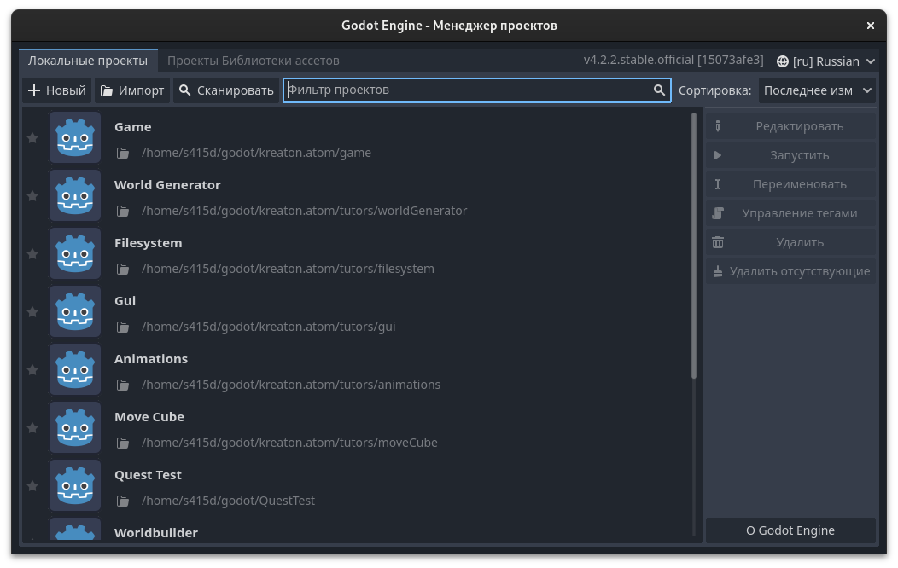
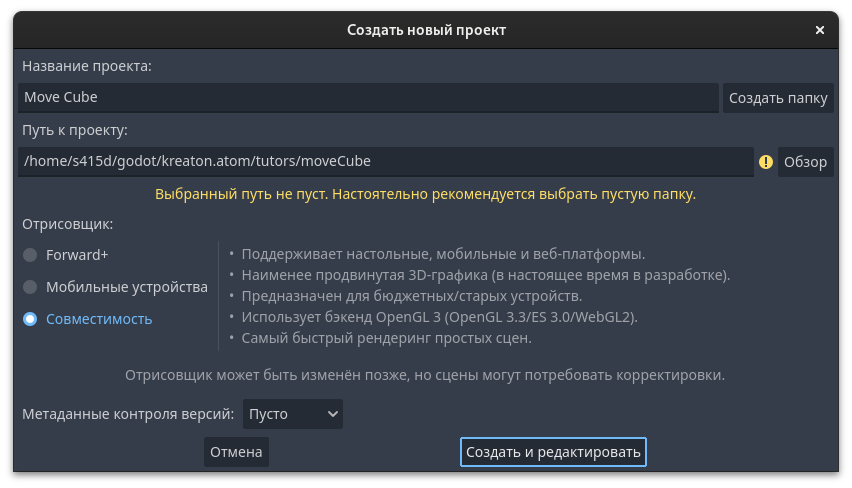
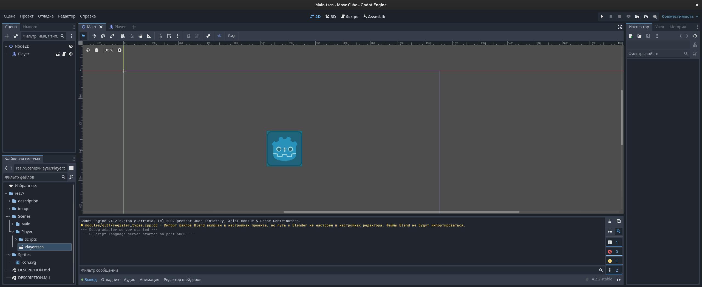
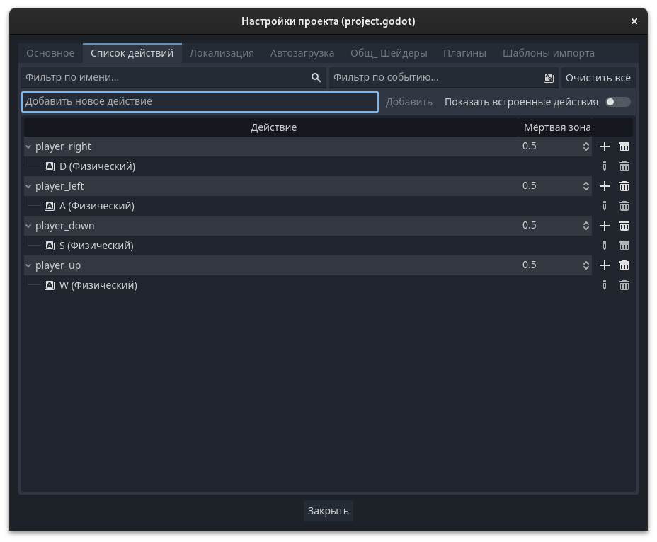

# Интерфейс

Здесь показан менеджер проектов. Ничего особенного, нажимаем на кнопку **+Новый**



Далее идёт настройка создаваемого проекта. После выбора пустой папки он автоматически-магическим образом наколдует название.


Получаем такое окно (только без файлов и сцен). Нужно будет перейти во вкладку 2D



# Начинаем работу

Создаем 2 сцены, одну наследуем от **Node2D** (2D сцена), который просто является объектом в пространстве, вторую от **Characterr Body** (Другой узел, далее в поиске ищем Character Body).

Сохраняем под любым названием.

## Character Body

### Настройка

Открыв вкладку со сценой добавляем дочерние объекты **Sprite2D** и **CollisionShape2D**, с помощью плюсика в левом верхнем углу во вкладке **Сцена**.

Выбираем **Sprite2D** во вкладке **Сцена** и в правой части экрана во вкладке **Инспектор** выбираем пункт **Texture**.

Нажимаем на пустое поле ввода и выбираем **Загрузка...**

Далее (заранее переместив в папку с проектом какую-либо картинку) выбираем текстуру для нашего спрайта. Можно использовать добавленный автоматом спрайт **icon.svg**.

Теперь выбираем **CollisionShape2D** и нажимаем на пункт **Shape**.

Выбираем **Новый RectangleShape2D**.

В окне со сценой подбираем размер нашего коллайдера.

### Добавление клавиш для взаимодействия

Идём по пути *Проект/Настройки проекта/Список действий*.



Пишем названия действий в поле **Добавить новое действие** и нажимаем **Добавить**

У каждого действия нажимаем на плюс справа и выбираем клавиши для ввода.

Если что мы создаем действия чтобы кубик двигался.

Закрываем окно.

### Кодим

Выбираем корень дерева сцены (У меня он называется Player).

Правую часть крутим до низа и нажимаем на пустое поле возде **Script**.

Выбираем новый скрипт, можете его как-то обозвать, выбрать какие вам удобоно галочки.

Далее можно вставить этот код с комментариями.

```GDScript
extends CharacterBody2D #Наследуем скрипт

const SPEED = 100 #Выбираем значение скорости

func _ready():#Функция вызываемая в начале скрипта
	velocity = velocity.limit_length(SPEED)#Ограничиваем длину вектора скорости объекта
											#Нужно чтобы движение по диагонали не было быстрее
											#чем движение вдоль осей

func _process(delta):#Функция вызываемая много раз. Разница между вызывами записана в параметре delta
	var velocity_coef = [0, 0]#Создаем массив для коэфициентов, на которые будет умножаться скорость
	if Input.is_action_pressed("player_left"):#Если было событие "player_left" 
		velocity_coef[0] = -1#Устанавливаем коэфициент для x
	if Input.is_action_pressed("player_right"):#Аналогично
		velocity_coef[0] = 1
	if Input.is_action_pressed("player_up"):
		velocity_coef[1] = -1
	if Input.is_action_pressed("player_down"):
		velocity_coef[1] = 1
	velocity.x = velocity_coef[0]*SPEED#Устанавливаем значение скорости игрока
	velocity.y = velocity_coef[1]*SPEED
	move_and_slide()#Вызывав эту функцию, мы сдвинем игрока

```

Сохраняем все наши издевательства над движком.

## Node2D

### Ничего особенного

Просто переносим нашу сцену с игроком на основную сцену.

Нажимаем F5 и нажимаем наши кнопки для управления, которые мы назначили
